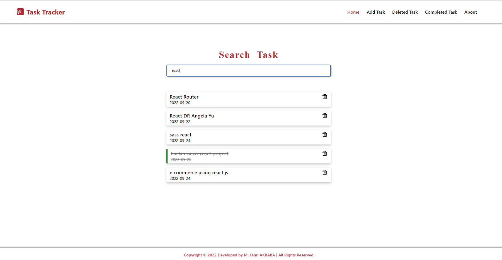
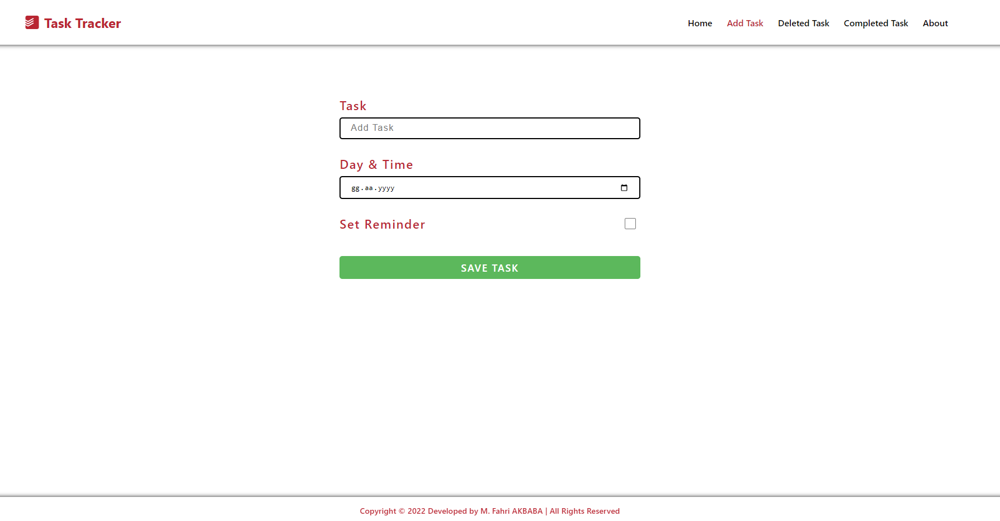
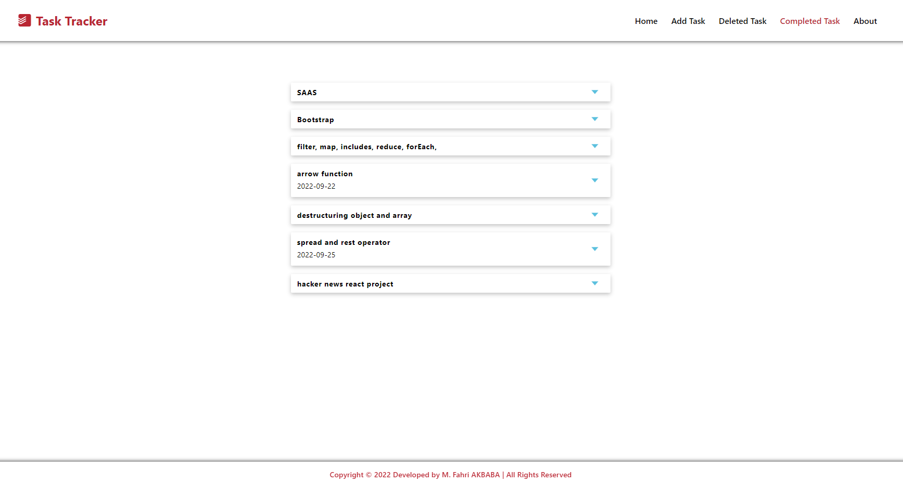
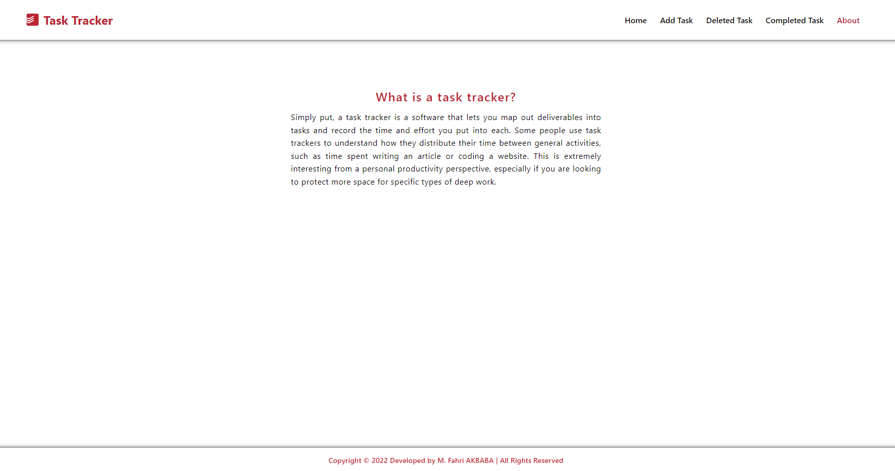

# Getting Started with Create React App

This project was bootstrapped with [Create React App](https://github.com/facebook/create-react-app).

#### What did I use when I was making this project?
1. Rest API (Fake API using JSON Server )
2. React Router
3. React Icon
4. Context API
5. React Form
6. React Tabs
7. React Accordion
8. React Filter Search
9. React module css

#### How to start this project:
1. firstly open new terminal and  you should write `cd .\React-Task-Tracker-using-Fake-API-main\` after that `npm install`  
2. `Start JSON Server`
   - `cd .\React-Task-Tracker-using-Fake-API-main\`
   - `json-server --watch db.json`
   - after that you must write inside db.json file following data:
   
   `{
  "tasks":[
    {
      "text": "Clean House",
      "day": "Saturday",
      "reminder": true, 
      "id": 5
    },
    {
      "text": "Eat a fish",
      "day": "Monday",
      "reminder": false,
      "id": 6
    },
    {
      "text": "Shopping meal",
      "day": "Monday",
      "reminder": false,
      "id": 7
    },
    {
      "text": "Wash a car",
      "day": "Tuesday",
      "reminder": true,
      "id": 8
    },
    {
      "text": "Brush your teeth",
      "day": "Everyday",
      "reminder": false,
      "id": 9
    },
    {
      "text": "Go to the cinema ",
      "day": "one day per a week",
      "reminder": false,
      "id": 10
    }
  ]
}`
3. `Open new terminal`
   - `cd task-tracker`
   - `npm start `
